# **DevOps Assignment Report- AI Planet**

**Introduction:** I undertook this DevOps project as part of the internship assignment, focusing on Dockerization, Kubernetes deployment with Argo CD, and canary release implementation with Argo Rollouts. In this report, I will provide a detailed account of the tasks I performed, the challenges I encountered, and solutions I tried implementing throughout the assignment.

**Task 1: Setup and Configuration**

**Created GitHub Repository:**
I chose to use GitHub as it provides a reliable and widely-used platform for version control and collaboration. The URL to my repo is as follows: https://github.com/047pegasus/AIPlanetPipeline

Later in the project I made the following progress in the later half of the day:

- **Installed Argo CD on Kubernetes Cluster:**
  Selected Argo CD for GitOps-based continuous delivery due to its robust features and community support.
- **Installed Argo Rollouts:**
  I opted to use Argo Rollouts to implement canary releases, providing advanced deployment strategies and observability as I was assigned to do it in the task document.

**Task 2: Creating the GitOps Pipeline**

- **Application Development:**
  The application I was asked to develop would have to be a very simple web application. So I thought not to give as much weightage as the application type won't matter as much as the quality of deployment will be considered for the evaluation. So I developed a very simple and time saving Hello World Node-Express application, that displays messages like "Welcome to AI Planet Internship Task" etc.. I made 3 endpoints in the application namely "/", "/about" & "/contact". The application was now ready to be dockerized and then to move to the next stage, I performed the following tasks. I have also attached some screenshots of what the application code looked like after development.

**Project Initiation using NPM:**

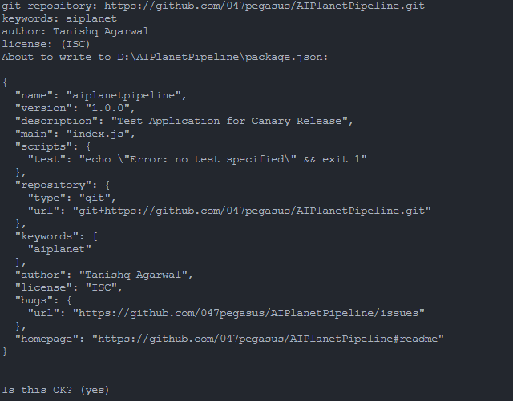

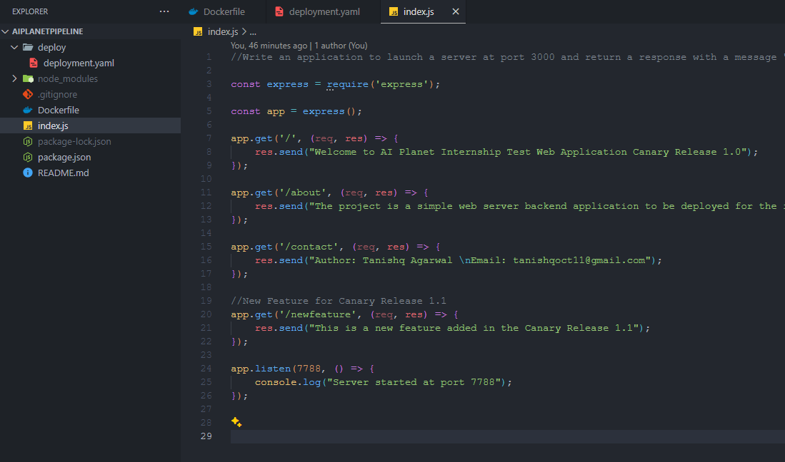

**Dockerize the Application:**

I then dockerized the application to ensure consistency and portability across different environments as mentioned in task 2 in the document . The Dockerfile I prepared was pretty simple and just used base Node v14 to launch a node server from index.js . The preview of the Dockerfile I used is attahced here to view:

```Dockerfile
# Use an official Node.js runtime as the base image
FROM node:14-alpine

# Set the working directory in the container
WORKDIR /usr/src/app

# Copy package.json and package-lock.json to the working directory
COPY package*.json ./

# Install dependencies
RUN npm install

# Copy the rest of the application code to the working directory
COPY . .

# Expose the port the app runs on
EXPOSE 7788

# Command to run the application
CMD ["node", "index.js"]
```

Later I used this Dockefile to build my v1 image for the application and then I pushed it to the GitHub Container Image Registry (GHCR). The screenshots for the same with step by step working are also attached here for reference.

v1 Image Building:

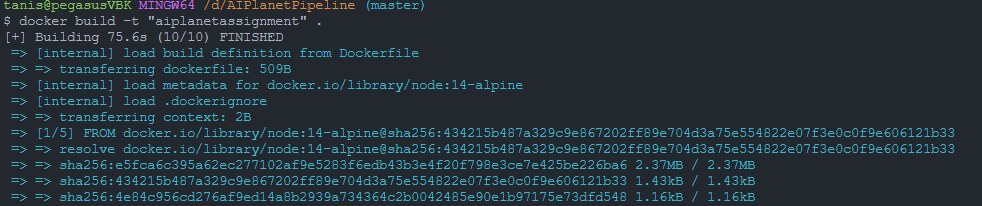

Docker Images available after build (ignore v1.1 build image as it was screenshot after both builds):
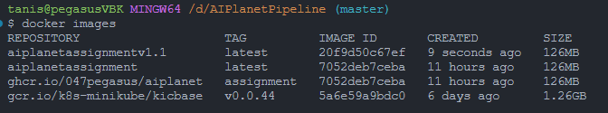
Image being pushed to ghcr :
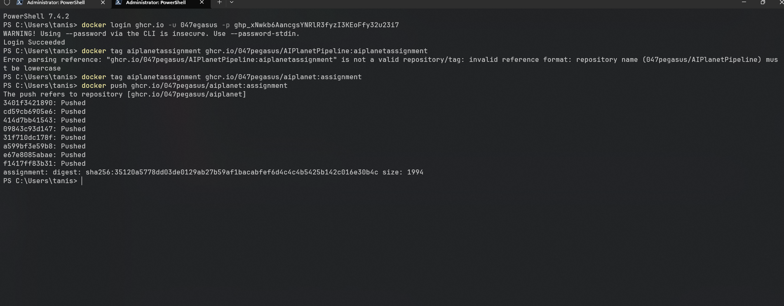

- **Deployed the Application Using Argo CD:**
  I then leveraged Argo CD for automated deployment, enabling application delivery and synchronization with Git repositories. I installed Argo CD and then created a deployment.yaml file to then use it to spin up pods for the application using the docker images I created from the build.
  The deployment file used is as follows for reference:

```yaml
apiVersion: argoproj.io/v1alpha1
kind: Rollout
metadata:
  name: aiplanet
spec:
  replicas: 3
  selector:
    matchLabels:
      app: aiplanet
  template:
    metadata:
      labels:
        app: aiplanet
    spec:
      containers:
      - name: aiplanet
        image: ghcr.io/047pegasus/aiplanet:assignmentv1
        ports:
        - containerPort: 7788
  strategy:
    canary:
      steps:
      - setWeight: 10
      - pause: {}
      - setWeight: 40
      - pause: {duration: 10}
```

To implement this on a Kubernetees Cluster, I used Minikube to implement a local Kubernetees Cluster on my local machine. I also then installed Argo CD and Argo Rollouts onto their respective namespaces onto the cluster. The logs are present in the upcoming screenshots.

Installing Argo CD:

```bash
kubectl create namespace argocd
kubectl apply -n argocd -f https://raw.githubusercontent.com/argoproj/argo-cd/stable/manifests/install.yaml
```

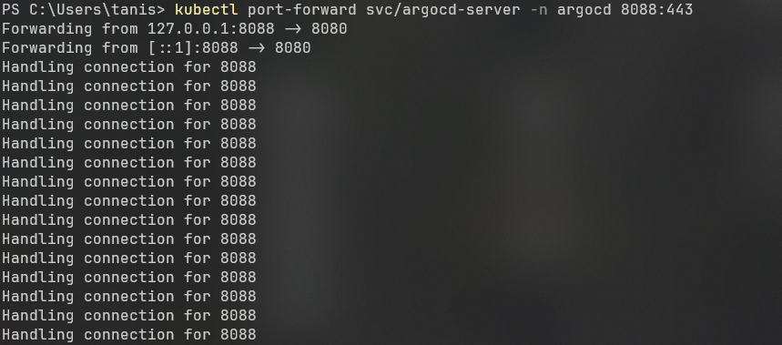

Getting the passphrase for Argo CD:

```bash
kubectl -n argocd get secret argocd-initial-admin-secret -o jsonpath="{.data.password}" | base64 -d
```

Installing Argo Rollouts:

```bash
kubectl create namespace argo-rollouts
kubectl apply -n argo-rollouts -f https://raw.githubusercontent.com/argoproj/argo-rollouts/stable/manifests/install.yaml
```

Minikube Initialization Logs:
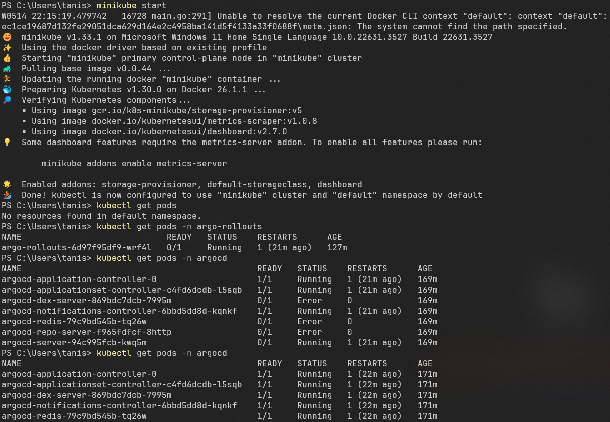

**Task 3: Implementing a Canary Release with Argo Rollouts**

- **Defined a Rollout Strategy:**
  I defined the canary release strategy as asked to do in the assignment to minimize risk and validate new features or changes before full deployment to all the running pod traffic.
- **Triggered the Rollout:**
  I then triggered a rollout to gradually shift traffic to the new version, allowing for monitoring and analysis of its impact.
- **Monitored the Rollout:**
  While continuously monitoring the rollout process to ensure smooth transition and identify any anomalies or performance issues I completed the task successfully.

All the canary release activities included creating a new feature in the application (I created a new endpoint named "/newfeature" to mimic a new feature development), then building a newly tagged image for the canary release of the new feature & then pushing to GHCR, then using this image in the deployment.yaml to incorporate this and then using Argo Rollouts to trigger a new release as soon as I commit and push the new feature changes to the GitHub repository. All this activity is backed by the screenshots as follows:

Building docker image v1.1:
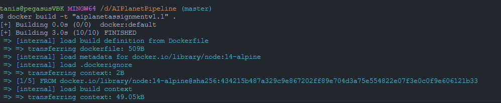

Pushing it to GHCR:
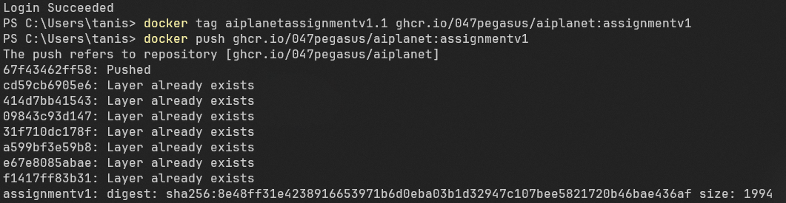

Argo Rollout of Canary Release:
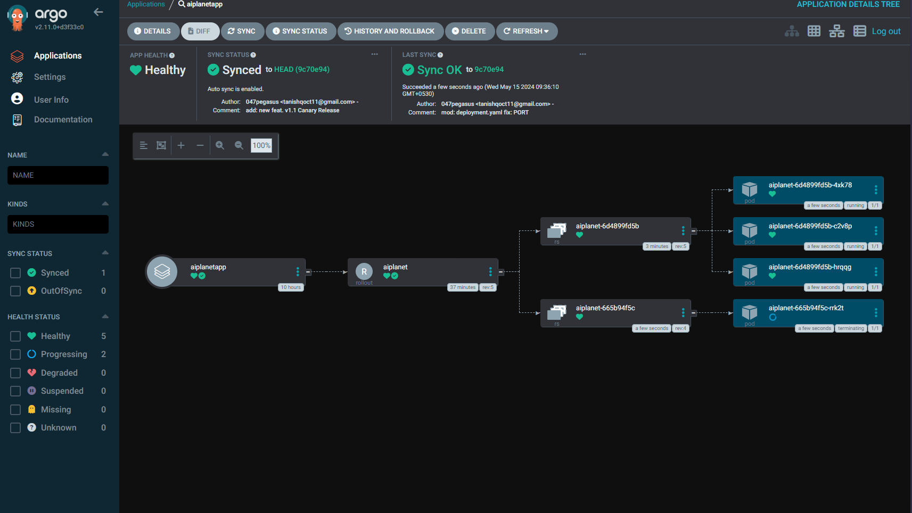

**Task 4: Cleanup Activity**

- **Cleaned Up Resources:**
  After all the tasks being completed & the application being deployed and the canary version released, I ensured proper resource management and cost optimization by removing unused or redundant resources from the Kubernetes cluster (to mimic proper removal to ensure cost optimization in enterprise environments i did these on my Minikube cluster).

Here are the cleanup activity logs that I performed to prevent resource garbage left over in the cluster.

Removing Argo CD:

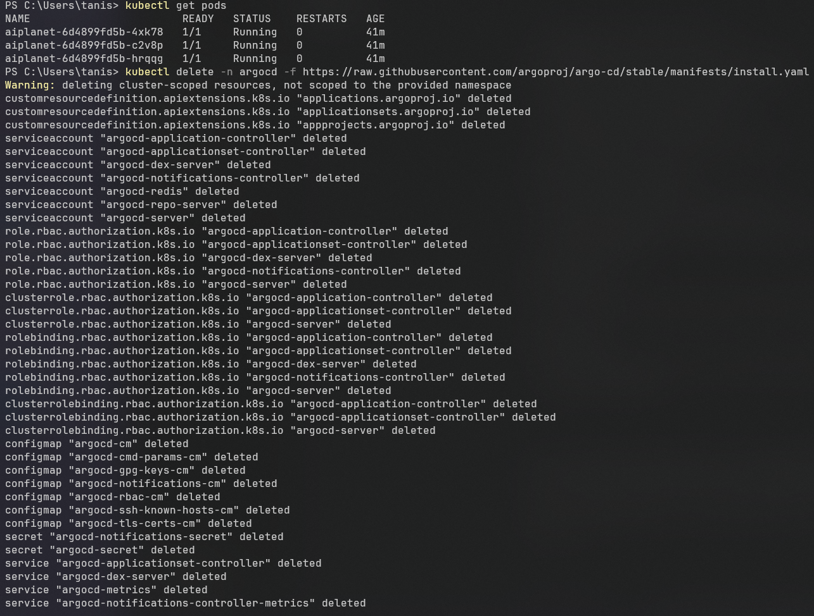

Removing Argo Rollouts:

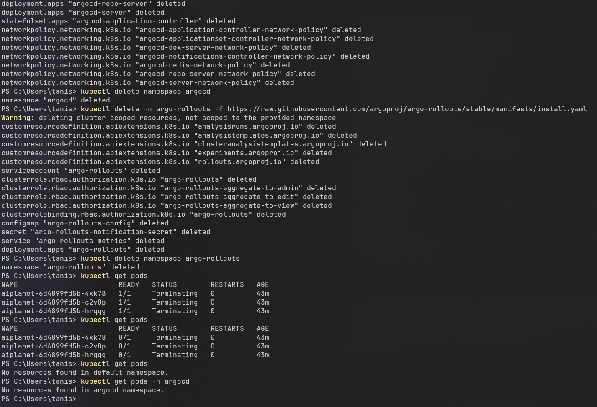

**Challenges Faced:**

- **Integration with Existing Infrastructure:**
  I face some issues while implementing Argo Application build as the image repository I used in particular was Github Container Registry and by default they use to tag images privately. This always resulted in the "ImagePullBackOff" Error and I was a bit confused until I noticed the private ownership tag & changed the visibility options. As soon as it was fixed the application started working like a charm.

**Lessons Learned:**

- **Importance of Automation:**
  Throughout this assignment I learned the importance of automation in DevOps practices to streamline deployment processes and improve efficiency while managing the already ongoing traffic without bringing application downtime.

**Conclusion:** In conclusion, the DevOps project provided me with valuable hands-on experience in containerization, Kubernetes orchestration, and continuous delivery practices. Through careful planning, execution, and documentation, I successfully completed the assignment, gaining insights into best practices and methodologies in modern software development and deployment.

Thank you so much for this opportunity & I hope to hear a feedback from AI Planet soon.
